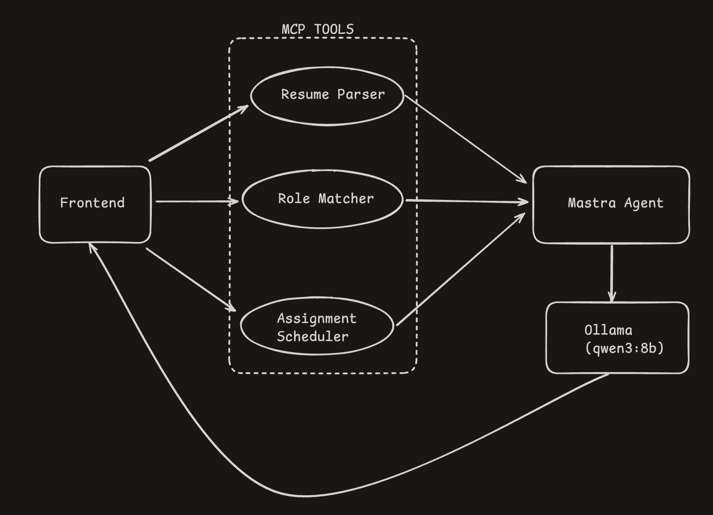

# HireMind - Automating Hiring Pipeline
**AI-powered hiring assistant for teams**

[](https://nextjs.org/)
[](https://www.typescriptlang.org/)
[](https://www.docker.com/)

*From CVs to shortlists – automated by multi‑agent AI.*

<p align="center">
  
  
</p>


**HireMind** is a multi‑agent system that streamlines recruitment by parsing CVs, matching candidates to roles and generating tailored assignments. Built with the **Mastra framework** and ready to deploy on the **Nosana decentralised compute network**.

## 🏗️ Architecture

<p align="center">
  
  
</p>

## 🎯 Platform Overview

**Mission:** Automate the hiring pipeline with collaborative AI agents, in other words your AI-powered recruiter assistant.

### Key Features

- **Resume Parsing** – Extracts skills, experience and metadata
- **Role Matching** – Scores and ranks candidates against role requirements
- **Assignment Generation** – Creates bespoke take‑home tasks per role
- **Multi‑Agent Studio** – Drag‑and‑drop agents onto a workspace to run flows
- **Email Integration** – API route scaffold to send results to candidates

### Technology Stack

- **Mastra** – Agent orchestration and tool calling
- **CopilotKit** – Natural language chat and control surface
- **Next.js** – Modern React UI
- **OpenAI / Ollama** – LLM providers
- **Docker** – Containerised runtime
- **Nosana Network** – Decentralised compute

## Getting Started

### Quick Start with Docker

```bash
git clone https://github.com/vijaykv5/nos-agent-challenge.git
cd nos-agent-challenge

cp .env.example .env

docker compose up --build
# App: http://localhost:3000
```

### Prerequisites

- Node.js 18+ and pnpm
- Docker and Docker Compose
- OpenAI API key (if using OpenAI)

### Development Setup

```bash
git clone https://github.com/vijaykv5/nos-agent-challenge.git
cd nos-agent-challenge

cp .env.example .env
pnpm install

pnpm run dev:ui      # UI at :3000
pnpm run dev:agent   # Mastra playground at :4111
```

Open <http://localhost:3000> for the UI and <http://localhost:4111> for the Agent Playground.

### Choose Your LLM

#### Option A: Shared Nosana Endpoint

```env
# Qwen3:8b – Nosana shared endpoint (Ollama-compatible; baseURL requires /api)
OLLAMA_API_URL=https://3yt39qx97wc9hqwwmylrphi4jsxrngjzxnjakkybnxbw.node.k8s.prd.nos.ci/api
MODEL_NAME_AT_ENDPOINT=qwen3:8b
```

If you see an HTML response like “Faithfully yours, frp.”, switch to OpenAI or local Ollama.

#### Option B: Local Ollama

```bash
ollama pull qwen3:0.6b
ollama serve
```

```env
OLLAMA_API_URL=http://127.0.0.1:11434/api
MODEL_NAME_AT_ENDPOINT=qwen3:0.6b
```

#### Option C: OpenAI

```env
OPENAI_API_KEY=your-key-here
```

Uncomment the OpenAI provider in `src/mastra/agents/index.ts` if needed.

## 🔧 Troubleshooting

- HTML “Faithfully yours, frp.” → shared node issue; use OpenAI or local Ollama
- Docker builds slow → ensure `.dockerignore` excludes `.next` and `node_modules`
- 401 from OpenAI → recheck `OPENAI_API_KEY`

## 🚀 Deployment

### Docker Compose

```bash
docker compose up --build
docker compose down
docker compose logs -f
```

### Manual Docker

```bash
docker build -t yourname/hiremind:latest .
docker run -p 3000:3000 -p 4111:4111 yourname/hiremind:latest
docker login
docker push yourname/hiremind:latest
```

### Deploy to Nosana

Using the dashboard:
1. Open the Nosana Dashboard (`https://dashboard.nosana.com/deploy`).
2. Click Expand to open the job editor.
3. Edit `nos_job_def/nosana_mastra_job_definition.json` and set your Docker image:
   ```json
   {
     "image": "yourname/hiremind:latest"
   }
   ```
4. Copy the job definition, choose a GPU, and Deploy Job.

Using CLI:
```bash
npm i -g @nosana/cli
nosana job post --file ./nos_job_def/nosana_mastra_job_definition.json --market nvidia-3090 --timeout 30
```

## ✅ Feature Checklist

- [x] Resume Parser Agent (`src/components/agents/ResumeParserAgent.tsx`)
- [x] Role Matcher Agent (`src/components/agents/RoleMatcherAgent.tsx`)
- [x] Assignment Scheduler Agent (`src/components/agents/AssignmentSchedulerAgent.tsx`)
- [x] Multi‑Agent Studio UI (`src/components/MultiAgentStudio.tsx`)
- [x] Email route scaffold (`src/app/api/send-emails/route.ts`)
- [x] Docker support

## 📚 Resources

- [Nosana Docs](https://docs.nosana.io)
- [Mastra Docs](https://mastra.ai/docs)
- [CopilotKit Docs](https://docs.copilotkit.ai)
- [Next.js Docs](https://nextjs.org/docs)
- [Nosana CLI](https://github.com/nosana-ci/nosana-cli)


**HireMind** – Automating the hiring pipeline with multi‑agent AI.
